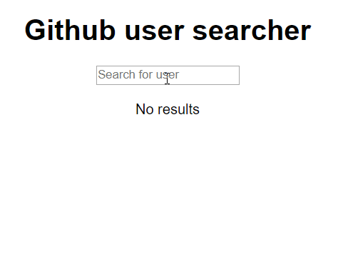

# Github users search

The aim of this app is searching github users based on the what an user type in the input. The app has been made using this api: `https://api.github.com/search/users?q=${query}`

**Functionalities:**

- When the search is loading, it shows "loading..."
- When the search is failed, it show "error fetching (reason why it failed)..."
- When the search result is empty (no users), it show "No results..."
- All state are managed using the context api!

